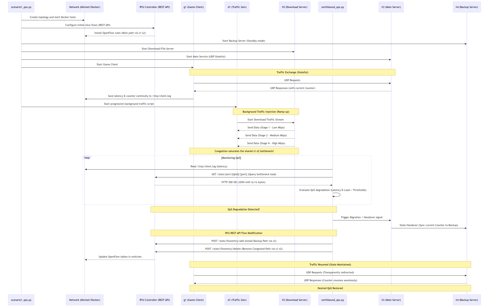
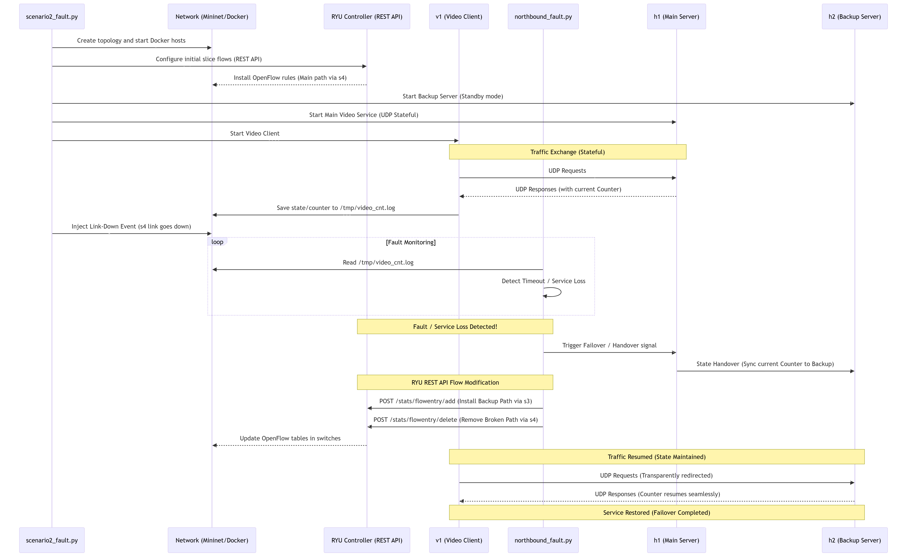
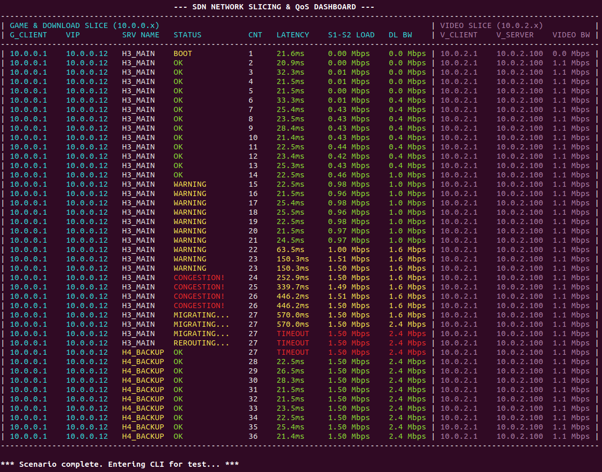
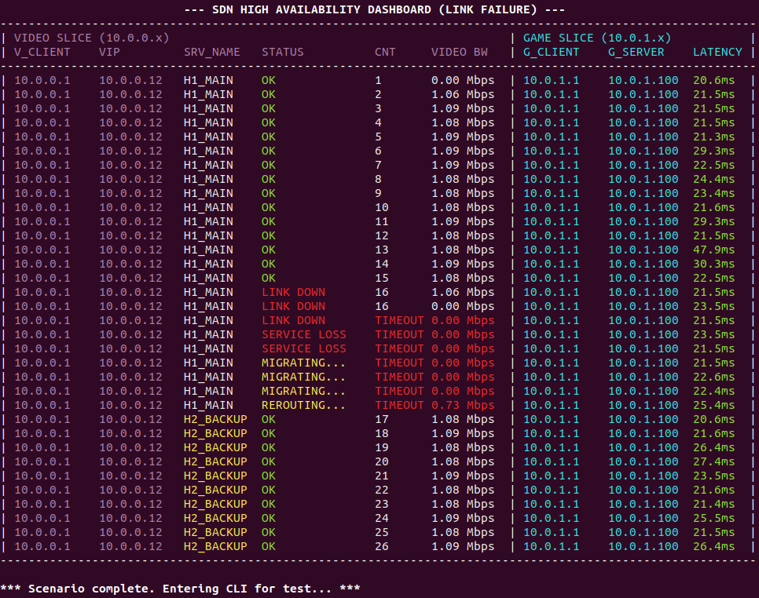

# SDN Network Slice Setup Optimization

This project implements a **network slicing and service migration** demo based on:

- **RYU SDN controller**
- **northbound scripts**
- **REST API**
- **ComNetsEmu / Containernet**
- **Docker-based services**

The goal is to show how a controller can configure and update slice paths dynamically and how a northbound script can react to QoS degradation or to an environmental change (Link down).
cia00
---

## Scenarios

The repository contains two final scenarios.

### Scenario 1 — QoS-aware migration under progressive congestion
A progressive background download is introduced in the **game slice**.  
The northbound logic monitors:

- game client latency
- timeout events
- bottleneck load on the main path

When congestion becomes persistent, the service is migrated from **h3** to **h4**, and the slice path is reprogrammed through the **RYU REST API**. 
At the same time, the **video slice** remains isolated and continues to show its uninterrupted streaming at constant bandwidth. 

### Scenario 2 — Link-failure failover with slice isolation
A **link-down** event is injected on the main path of the video service.  
The northbound logic detects service loss through the video client log and performs a failover from **h1** to **h2**.  
At the same time, the **game slice** remains isolated and continues to show its own slow latency.

So, the two scenarios together demonstrate:

- **slice creation**
- **slice isolation**
- **dynamic path reconfiguration**
- **service migration / failover**
- **statefulness**
- **reaction to environmental changes**

---

## Role of the main components

### 1. RYU SDN controller
RYU is the SDN control plane of the project.

Its tasks are:

- discover the OpenFlow switches
- maintain forwarding control
- receive REST requests from the northbound logic
- install or modify flow entries to realize the required network slices

The implementation relies on a RYU configuration compatible with:

- `ryu.app.simple_switch_13`
- `ryu.app.ofctl_rest`

### 2. Northbound scripts
The northbound logic is the “decision layer” of the project.

- `scenario1_qos.py` builds the topology, injects congestion, starts services and clients, and calls the QoS-oriented northbound monitor
- `scenario2_fault.py` builds the topology, injects a link failure, starts services and clients, and calls the failover-oriented northbound monitor
- `northbound_qos.py` decides when QoS degradation is persistent enough to trigger migration
- `northbound_fault.py` decides when service loss is persistent enough to trigger failover

### 3. REST API
The RYU REST API is used as the interface between the scenario logic and the controller.

The API client in `northbound_api.py` is used to:

- wait for switch discovery
- read port statistics
- add flow entries
- modify flow entries
- delete flow entries if needed

### 4. ComNetsEmu / Containernet / Docker
The virtual environment is built with **Containernet in ComNetsEmu**.

This makes it possible to have:

- Mininet-style hosts and switches
- Docker-based service nodes
- configurable links with bandwidth and delay

The migrated services run inside **Docker hosts**.

---

## Repository structure

- `scenario1_qos.py` — congestion scenario with QoS-aware migration
- `scenario2_fault.py` — link-failure scenario with failover
- `northbound_api.py` — REST helper for RYU
- `northbound_qos.py` — QoS monitor and migration trigger
- `northbound_fault.py` — service-loss monitor and failover trigger
- `slice_profiles.py` — OpenFlow slice profiles used for initial setup and failover
- `server.py` — stateful UDP service with counter/state handover
- `build_docker_images.sh` — helper to build Docker images
- `run_ryu.sh` — helper to start RYU with REST support

---

## Scenario 1 — QoS-aware service migration

### Topology
The first scenario uses:

- `g1` → service client
- `d1` → background download client
- `h5` → file/download server
- `v1` → video client
- `h1` → video server
- `h3` → main service instance
- `h4` → backup service instance
- `s1`, `s2`, `s3`, `s4` → OpenFlow switches

The path between `s1` and `s2` is the bottleneck path, while the alternative route through `s3` is used after migration.

### Workflow
1. The topology is created and the initial slice flows are configured.
2. The main UDP stateful service starts on `h3`.
3. A game client on `g1` periodically measures:
   - service counter continuity
   - response latency
4. A background traffic generator on `d1` starts a **progressive ramp-up in trafic** toward `h5`.
5. The northbound QoS monitor reads:
   - latency from `/tmp/client.log`
   - load from the bottleneck port stats
6. When latency degradation and load persist, the service is migrated to `h4`.
7. The flow on `s1` is modified so that traffic is redirected from the old path to the backup path.

### Sequence Diagram

You can download the [SVG](Sequence-Diagram-Scenario1.svg) version.

This scenario implements the idea of **dynamic re-allocation of a service under QoS degradation**.  

---

## Scenario 2 — Link-failure failover with slice isolation

### Topology
The second scenario uses:

- `v1` → video client
- `g1` → game client
- `h3` → game server
- `h1` → main service instance
- `h2` → backup service instance
- `s1`, `s2`, `s3`, `s4` → OpenFlow switches

The main video path initially goes through `s4`, while the backup path is pre-installed through `s3`.

### Workflow
1. The topology is created and initial slice flows are configured.
2. The main stateful service starts on `h1`.
3. The video client continuously polls the service and updates `/tmp/video_cnt.log`.
4. The game slice generates independent latency measurements in `/tmp/game_lat.log`.
5. A separate UDP video bandwidth stream is generated to show traffic on the active video slice.
6. After a delay, the script forces the link `s1`–`s4` **down**.
7. The northbound fault monitor detects consecutive service timeouts.
8. The backup service starts on `h2`.
9. The flow on `s1` is modified to redirect the video slice toward `s3`.
10. The dashboard switches from `H1_MAIN` to `H2_BACKUP`.

In this scenario the environmental change is a **link failure**, and the northbound logic reacts by restoring service continuity through failover.

### Sequence Diagram

You can download the [SVG](Sequence-Diagram-Scenario2.svg) version.

---

## Slice logic

The slicing behavior is defined in `slice_profiles.py`.

### QoS scenario
The initial profile creates:

- a client/service slice for the migrated UDP service
- a download slice for background traffic
- a separate video slice

The failover profile changes the forwarding rule so the service traffic is sent toward the backup path.

### Link down scenario
The initial profile creates:

- a video/service slice on the main path through `s4`
- a backup path already available through `s3`
- a separate game slice through `s2`

The failover profile updates only the entry needed to redirect the video traffic to the backup path.

---

## Northbound script decision logic

### QoS monitor
`northbound_qos.py` evaluates:

- latency samples
- timeout events
- bottleneck load

The migration is triggered only when the violation is persistent, not on a single bad sample.  

### Link down monitor
`northbound_fault.py` evaluates:

- consecutive `TIMEOUT` samples from the video client
- main-path traffic measurements

The migration is triggered only after the service loss persists for a short hold-down interval.

---

## Dashboard output

Both scenarios print a real-time textual dashboard.

### Scenario 1 dashboard shows
- active service host (`H3_MAIN` / `H4_BACKUP`)
- state (`OK`, `WARNING`, `CONGESTION!`, `MIGRATING...`, `REROUTING...`)
- service counter
- latency
- bottleneck load
- background download bandwidth
- video slice bandwidth



### Scenario 2 dashboard shows
- active service host (`H1_MAIN` / `H2_BACKUP`)
- state (`OK`, `LINK DOWN`, `SERVICE LOSS`, `MIGRATING...`, `REROUTING...`)
- video service counter
- active video path bandwidth
- game latency


---

## Prerequisites

Typical requirements are:

- Python 3
- RYU
- Open vSwitch
- ComNetsEmu / Containernet
- Docker
- `iperf`

The project also assumes that the controller REST API is reachable at:

- `127.0.0.1:8080`

and that OpenFlow switches connect to:

- `127.0.0.1:6653`

---

## How to run

### 1. Build Docker images
Use the repository helper:

```bash
./build_docker_images.sh
```

The final scripts use the Docker host image:

```bash
dev_test_py3
```

### 2. Start the RYU controller
In another terminal, start RYU with `simple_switch_13` and REST support.

For example, through the repository helper:

```bash
./run_ryu.sh
```

or with an equivalent command that includes:

```bash
ryu.app.simple_switch_13
ryu.app.ofctl_rest
```

### 3. Run a scenario

```bash
sudo python3 scenario1_qos.py
```

or

```bash
sudo python3 scenario2_fault.py
```

---

## Expected results

### Scenario 1
You should observe:

- normal low latency at the beginning
- progressive load increase due to background traffic
- `WARNING` and then `CONGESTION!`
- service migration from `h3` to `h4`
- dashboard continuity of the service counter after migration

### Scenario 2
You should observe:

- normal service operation on `h1`
- a forced `LINK DOWN`
- `SERVICE LOSS`
- backup activation on `h2`
- rerouting of the video slice
- service continuity restored on the backup node

---

## Final remarks

This implementation combines:

- **network slicing**
- **service state transfer**
- **northbound monitoring**
- **REST-based reconfiguration**
- **scripted environmental changes**
- **real-time dashboard feedback**


